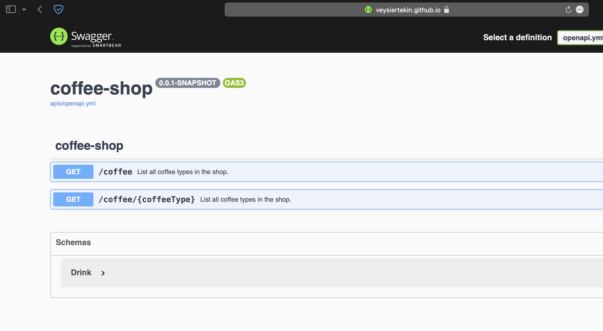

# HTTP Framework Samples in Scala

# Design

All implementations follows below design:

<br><br><br><br>

<br><br><br><br>

# Rest implementation: ☕️ Coffee Shop API

All examples are using [coffee-shop](https://github.com/veysiertekin/coffee-shop) static rest service except ZIO Http because of the some bugs. For ZIO, I have implemented a simple [Heroku service described here](https://github.com/veysiertekin/scala-http-framework-samples#simple-remote-service-on-heroku).


|Endpoint|Description|Return type|Request example|Return example|
|---|---|---|---|---|
|/coffee|Returns coffee types|<pre>Array[String]</pre>|http://localhost:9000/coffee|<pre>[<br>    "hots",<br>    "iced" <br>]</pre>|
|/coffee/#category|Drinks in the category|<pre>Array[<br>    Drink(<br>      title: String,<br>      id: Int,<br>      description: String,<br>      ingredients: List[String]<br>    )<br>]</pre>|http://localhost:9000/coffee/hots|<pre>[<br>    {<br>        "title": "Black",<br>        "id": 1,<br>        "description": "Black coffee is as simple as it gets with ground coffee beans steeped in hot water, served warm. And if you want to sound fancy, you can call black coffee by its proper name: cafe noir.",<br>        "ingredients": [<br>            "Coffee"<br>        ]<br>    },<br>...</pre>|


## Akka Http

* Functional implementation
* [Native Datadog support](https://docs.datadoghq.com/tracing/setup_overview/compatibility_requirements/java/#web-framework-compatibility)
* Supports full HTTP protocol
* Detailed documentation: [https://doc.akka.io/docs/akka-http/current/index.html](https://doc.akka.io/docs/akka-http/current/index.html)

## Http4s

* Functional implementation
* Support for effect libraries (cats effect etc)
* Limited Datadog support via third party libraries ( [avast/datadog4s](https://github.com/avast/datadog4s), [Kamon](https://github.com/kamon-io/Kamon) etc). Integration in progress: [https://github.com/DataDog/dd-trace-java/issues/1934](https://github.com/DataDog/dd-trace-java/issues/1934)
* Supports full HTTP protocol
* Limited documentation: [https://http4s.org/v0.23/index.html](https://http4s.org/v0.23/index.html)

## ZIO Http

(as of writing this documentation) 

* Does not support full Http Protocal
* No native Datadog support yet
* Client has major pitfalls: stable channel does not have Https support. Beta channel has some bugs (removes trailing `/` in the URLS etc)
* Functional, and follows effect library guides
* Limited documentation (explains just a simple example): [https://dream11.github.io/zio-http/docs/index](https://dream11.github.io/zio-http/docs/index)


## Finatra

* Play like dependency framework (Guice) support by default
* Supports full HTTP protocol
* Supports both Twitter's Future or Cats effect for processing
* [Native Datadog support](https://docs.datadoghq.com/tracing/setup_overview/compatibility_requirements/java/#web-framework-compatibility)
* Detailed documentation: [https://twitter.github.io/finatra/user-guide/](https://twitter.github.io/finatra/user-guide/)

# OpenAPI Endpoint

All tapir implementations exposes documentation automatically on API level.

ReadDoc Web UI: [http://localhost:9000/docs](http://localhost:9000/docs)


Additionally, `tapir-akka-http` also implements a way of exporting openapi yaml. A Github Action uses this implementation and publishes a static swagger documentation at [http://veysiertekin.github.io/scala-http-framework-samples](http://veysiertekin.github.io/scala-http-framework-samples)



# Simple Remote Service on Heroku

(This Heroku service has been used in ZIO Http)

1- Go to [heroku-coffee-shop-service/](heroku-coffee-shop-service) in your terminal.

2- Login to Heroku:

```bash
heroku login
```

3- Create a simple app

```bash
heroku create
git push heroku main
```

4- Start application by scaling it to `1`

```bash
heroku ps:scale web=1
```

4- You can view http location of the service by:

```bash
heroku open
```
